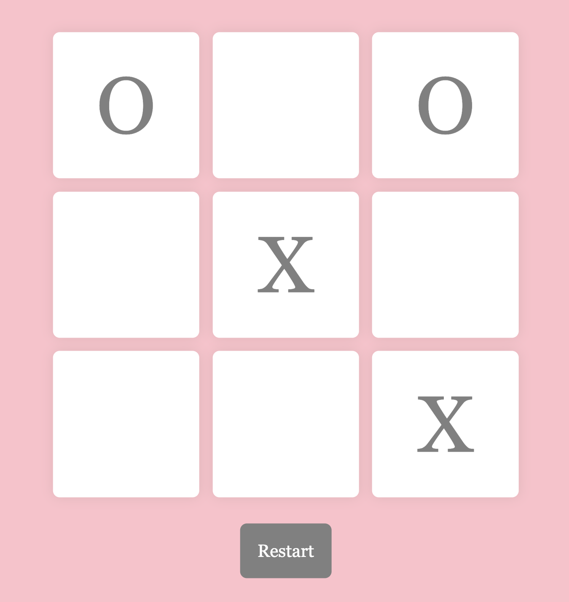

# Tic Tac Toe

 
 

# About

[Click here to play Tic Tac Toe.](https://rainakpuels.github.io/Tic-Tac-Toe)

This is an exercise developed during MIT xPro Full Stack Professional Certificate in Coding.

Using JavaScript, HTML, and CSS I created a React Tic Tac Toe board.
	
# How to Run
If you want to run it on a browser, just click the above link to play! 

If you want to run it locally:

    Download the files.
    Run the "index.html" file in your broswer.

# Roadmap of Future Improvemenets
Usually, when Tic Tac Toe is played on paper, the winner strikes through their three in a row. It would be great to have this as part of the virtal game.

It would also be fun to replace the Xs and Os with emojis or other fun symbols.

# Liscence Information 
[MIT License](https://github.com/rainakpuels/Tic-Tac-Toe/blob/default/LICENSE)

